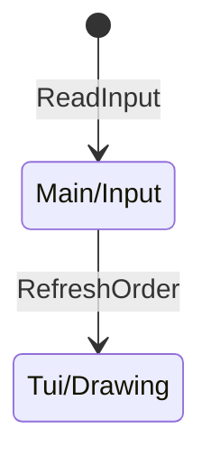
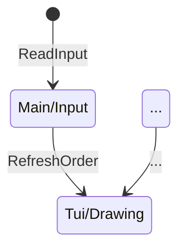
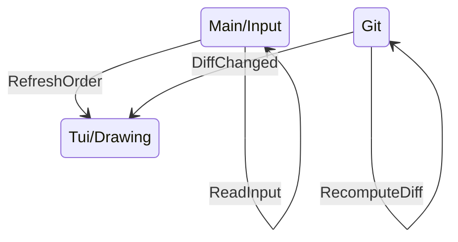

# Multithreading dans Giga

<div style="
    width: 100%;
    margin-top: 5%;
    margin-left: 40%;
    ">

<Transform
    :scale=1.5
    >

</Transform>

</div>

---
layout: full
---

# Multithreading dans Giga

<div style="
    width: 100%;
    margin-top: 5%;
    margin-left: 30%;
    ">

<Transform
    :scale=1.5
    >

</Transform>

</div>

---
layout: image-right
image: ./images/vsc_diff.png
---

# Calculer le diff Git

```sh
echo $content | diff <(git show HEAD:$file) -
```

```diff
1c1,2
< Hello, World !
---
> Hello
> World
```

$\downarrow$ Parsing

```rust
enum PatchType {
    Added,
    Deleted,
    Changed,
}
struct Patch {
    start: usize,
    count: usize,
    patch_type: PatchType,
}
type Diff = Vec<Patch>;
```


---
layout: full
---

# Multithreading dans Giga

<div style="width: 100%;margin-top: 10%; margin-left: 15%">

<Transform :scale=1.5>

</Transform>

</div>


---
layout: center
---

# Et une démo de plus

```sh
giga README.md
```
