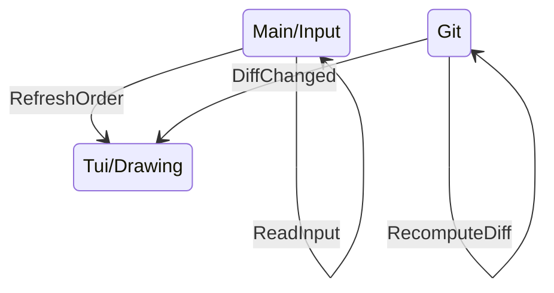

# Multithreading dans Giga

<div style="width: 100%;margin-top: 10%; margin-left: 15%">


<Transform :scale=1.5>

</Transform>

</div>

---
layout: center
---

# Calculer le diff Git

```sh
echo $content | diff <(git show HEAD:$file) -
```

```diff
1c1,2
< Hello, World !
---
> Hello
> World
```

---
layout: center
---

# Et une démo de plus

```sh
giga README.md
```
