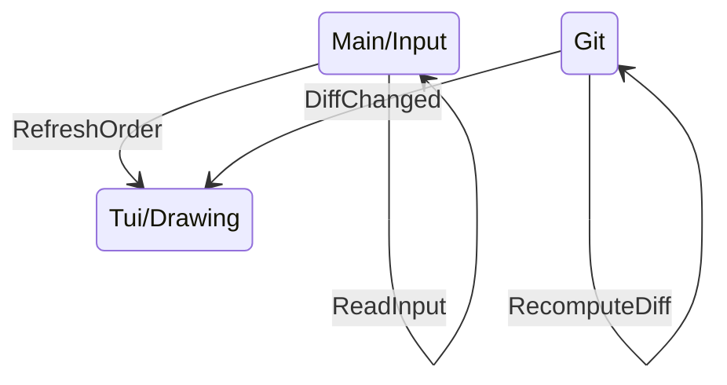

## Multithreading dans Giga



---
layout: center
---

## Calculer le diff Git

```sh
echo $content | diff <(git show HEAD:$file) -
```

```diff
1c1,2
< Hello, World !
---
> Hello
> World
```

---
layout: center
---

## Et une démo de plus

```sh
giga README.md
```
