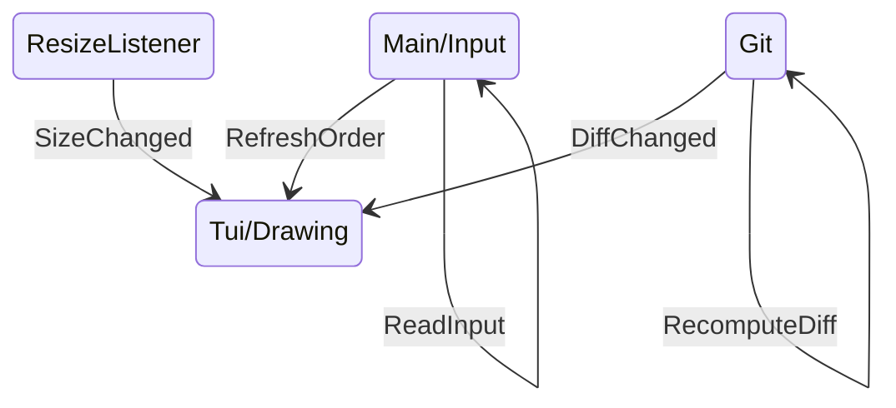

# Les signaux en Rust

Lorsque l'utilisateur redimensionne la fenêtre, le programme reçoit un signal
<kbd style="font-size: 1.5em">SIGWINCH</kbd>.

J'ai pas trouvé... → du coup on fait du C.


```rust {all|6-9|15-17|all}
static mut TX: Option<Sender<()>> = None;

pub fn init_resize_listener(tx: Sender<()>) {
    unsafe {
        TX = Some(tx);
        libc::signal(
            libc::SIGWINCH,
            resize_handler as libc::sighandler_t
        );
    }
}

// Handler called on SIGWINCH
unsafe extern "C" fn resize_handler(_: libc::c_int) {
    TX.as_ref().unwrap().send(());
}
```

---
layout: full
---

# Intégration dans Giga



---
layout: full
---

# Encore une démo

```sh
giga README.md
```
