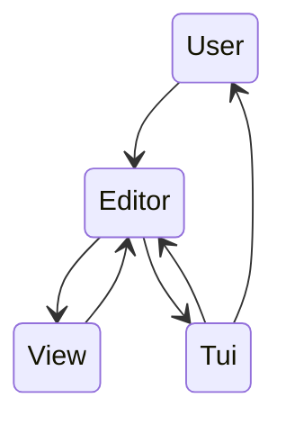

# Refaire Vim en Rust !

Le pattern MVC
<transform :scale=1.5
  style="margin-top: 6; margin-left: 15%"
>

</transform>
---
layout: full
---

# La View: une représentation intuitive de l'éditeur

<div
  style="
    display: flex;
    flex-direction: row;
    justify-content: space-evenly;
    height: 100%;
    margin-top: 8%;
    "
>
  <div
    style="
      height: 70%;
      width: 40%;
      "
  >

<!-- Small rectangle that scrolls vertically on a bigger rectangle -->

<div id="big-rectangle">
  <!-- Small rectangle -->
  <div id="small-rectangle"></div>
</div>

<style>
  #big-rectangle {
    width: 80%;
    height: 100%;
    background-color: darkgray;
    position: relative;
    border-radius: 25px;
  }

  #small-rectangle {
    width: 60%;
    height: 30%;
    background-color: darkslategray;
    position: relative; /* Changed from absolute to relative */
    top: 10%; /* Changed from top to padding-top */
    left: 10%; /* Changed from left to padding-left */
    border-radius: 10px;
    animation-name: scroll;
    animation-duration: 20s;
    animation-iteration-count: infinite;
    animation-timing-function: linear;
  }

  @keyframes scroll {
    0% {
      top: 10%; /* Changed from top to padding-top */
    }
    25% {
      top: 50%; /* Changed from top to padding-top */
      left: 10%; /* Changed from left to padding-left */
    }
    50% {
      top: 50%; /* Changed from top to padding-top */
      left: 30%; /* Changed from left to padding-left */
    }
    75% {
      top: 50%; /* Changed from top to padding-top */
      left: 10%; /* Changed from left to padding-left */
    }
    100% {
      top: 10%; /* Changed from top to padding-top */
    }
  }
</style>


  </div>

  <div>

  ```rust
  /// The View struct represents the actual
  /// portion of the File being displayed.
pub struct View {
    /// The file being displayed
    file: File,

    /// Position of the view in the file
    start_line: usize,
    start_col: usize,

    /// The dimensions of the view
    height: usize,
    width: usize,

    /// The position of the cursor relative to the view
    cursor: (usize, usize),
}
  ```

  </div>


</div>


---
layout: center
---

# It's demo time !
