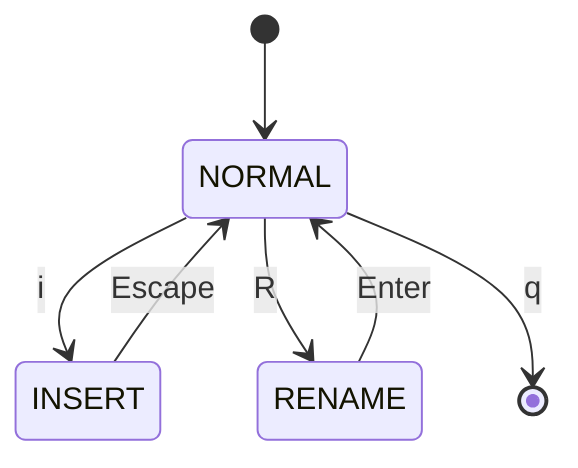
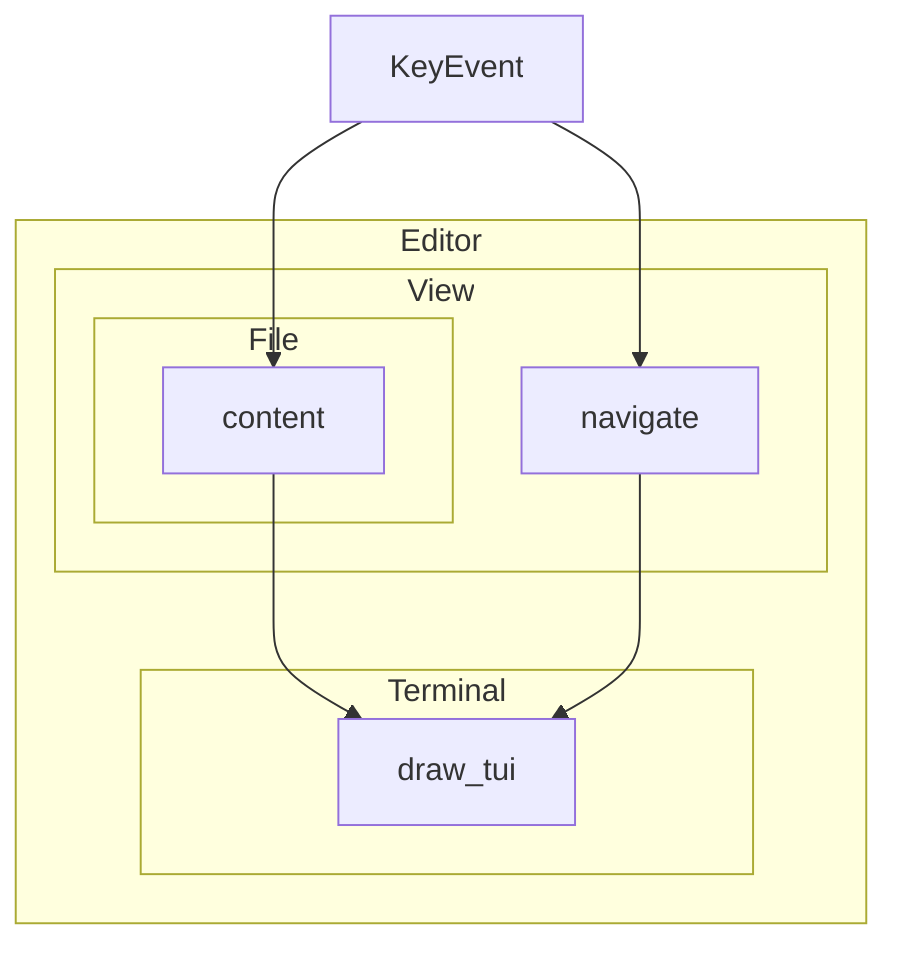

# Giga

## un editeur de texte écrit en Rust
Tout le code est disponible sur GitHub à https://github.com/florentinl/giga

---
layout: center
---

# Avant toute chose, une démonstration

```sh
giga README.md
```

---
layout: center
---

# Modes



---
layout: center
---

# La structure de l'éditeur (simplifiée)


