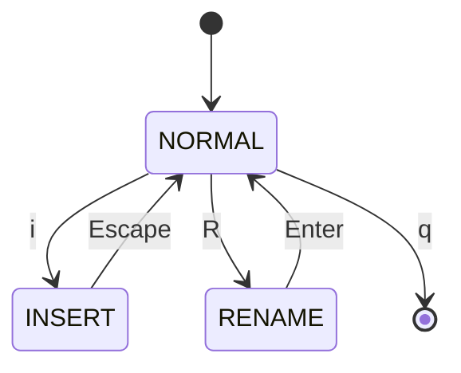
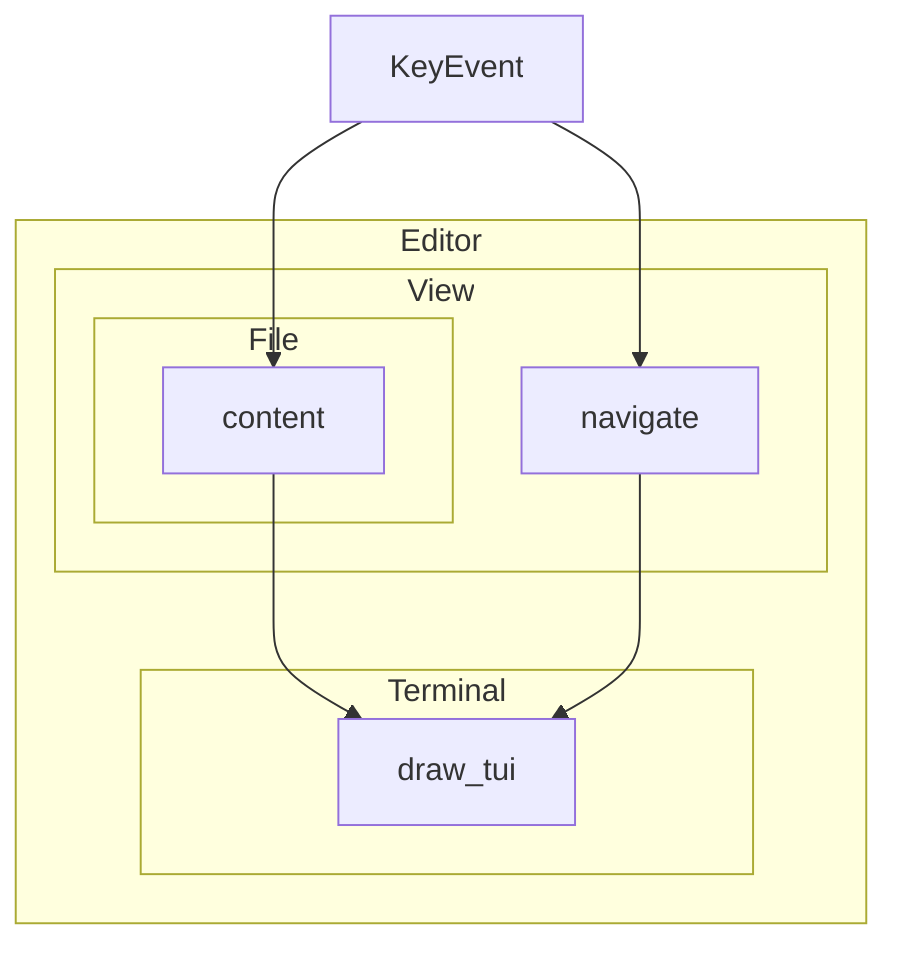

# Giga

## A simple editor written in rust
All code of our editor is available on [github](https://github.com/florentinl/giga)

---

# Why Rust ?


Rust is safe, fast and a modern system-programming language.

More, with cargo it's easy to :

- Build
- Test
- Run
- Publish
- Create Documentation

---
layout: center
---

# Let's run a demo

```sh
giga README.md
```

---
layout: center
---

# Modes



---
layout: center
---

# Structure (simplified)


