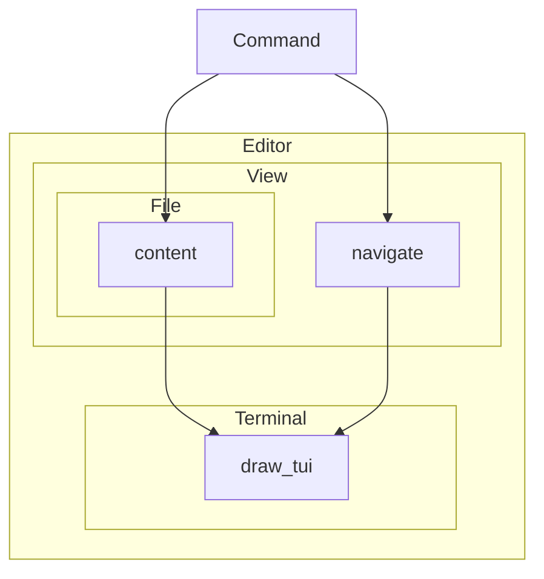

# Giga

## un editeur de texte écrit en Rust
Tout le code est disponible sur GitHub à https://github.com/florentinl/giga

---
layout: center
---

# Avant toute chose, une démonstration

```sh
giga README.md
```

---
layout: center
---

# Structure du programme

```sh
$ tree
.
├── editor
│   ├── command.rs
│   ├── mod.rs           ← Instancie les modules et gère les commandes
│   ├── terminal
│   │   ├── mod.rs       ← Gère l'interaction avec le terminal
│   │   └── termion.rs
│   └── view
│       ├── file
│       │   └── mod.rs   ← Représente en mémoire le fichier édité
│       └── mod.rs       ← Calcule ce qui est affiché
└── main.rs              ← Initialise giga
```

---
layout: center
---

# Modes


---
layout: center
---

# Comment représenter une fenêtre ?


